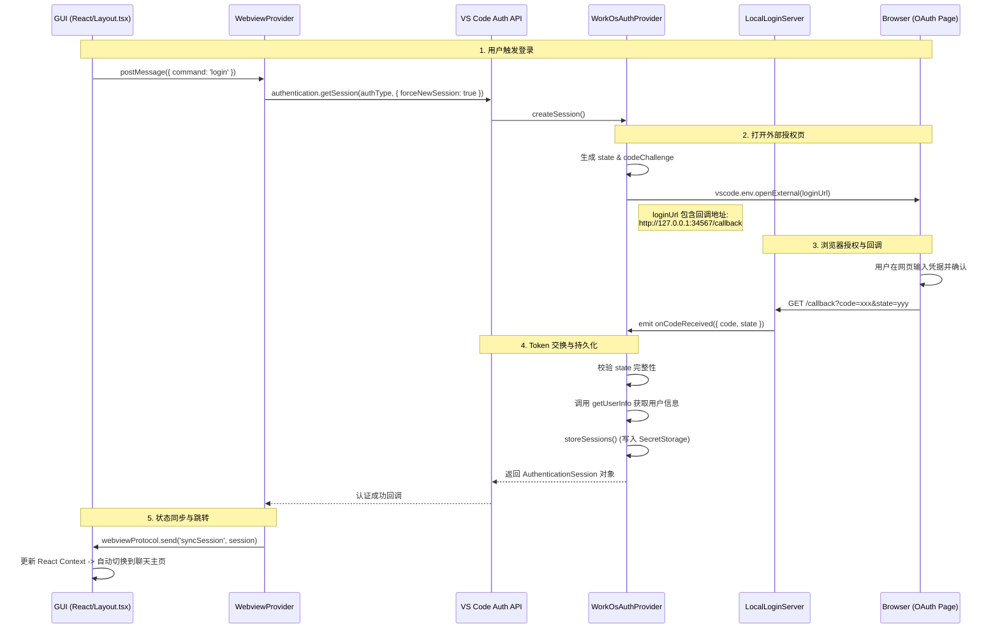

# VS Code 插件登录流程逻辑梳理

本文档旨在详细说明插件在 VS Code 环境下的身份验证（Auth）实现机制、涉及的核心组件及数据流转过程。

## 1. 核心设计架构

采用了 **VS Code 标准 AuthenticationProvider 协议**，并结合**本地 HTTP 服务器**处理 OAuth 回调，确保了在各种复杂网络环境（如内网、代理）下的登录稳定性。

### 核心组件职责

- **WorkOsAuthProvider**: 插件侧的身份验证提供者，对接 VS Code 原生认证接口，负责 Token 的交换、刷新和会话管理。
- **LocalLoginServer**: 插件启动时在本地（34567 端口）开启的 HTTP 服务，作为 OAuth 回调的接收端，避免了复杂的 URI Scheme 注册问题。
- **SecretStorage**: 利用 VS Code 提供的安全存储 API，将 Access Token 持久化到操作系统的凭据管理器中。
- **Layout & Auth Context**: 前端路由守卫，根据 Session 状态决定 UI 展示（登录页 vs 聊天页）。

***

## 2. 涉及文件清单

| 模块        | 文件路径                                                      | 功能描述                                 |
| :-------- | :-------------------------------------------------------- | :----------------------------------- |
| **入口**    | `extensions/vscode/src/extension/VsCodeExtension.ts`      | 初始化 AuthProvider 和本地服务器。             |
| **协议层**   | `core/control-plane/AuthTypes.ts`                         | 定义环境配置（APP\_URL）和 Session 数据结构。      |
| **逻辑实现**  | `extensions/vscode/src/stubs/WorkOsAuthProvider.ts`       | **核心逻辑**：生成登录 URL、监听回调、交换 Token。     |
| **回调处理**  | `extensions/vscode/src/activation/localServer.ts`         | 本地 HTTP 服务器，接收浏览器返回的 `code`。         |
| **安全存储**  | `extensions/vscode/src/stubs/SecretStorage.ts`            | 封装 VS Code Secrets API，用于加密存储 Token。 |
| **UI 容器** | `extensions/vscode/src/ContinueGUIWebviewViewProvider.ts` | 监听前端登录指令，并触发 VS Code 认证弹窗。           |
| **前端状态**  | `gui/src/context/Auth.tsx`                                | React 全局状态，通过消息协议同步后端 Session。       |
| **前端路由**  | `gui/src/components/Layout.tsx`                           | 登录拦截逻辑，控制 `isSessionLoading` 状态。     |

***

## 3. 详细登录流程图

***

## 4. 关键机制说明

### 4.1 本地服务器中转机制

由于某些系统或浏览器对 `vscode://` 协议的支持不稳定，插件通过 `LocalLoginServer` 在本地监听请求。当 OAuth 流程结束后，浏览器跳转至 `http://127.0.0.1:34567/callback`，插件内部的服务器直接捕获该请求，极大地提高了登录成功率。

### 4.2 登录闪现优化

在旧版本中，由于前端 React 加载快于后端 Session 获取，用户会看到短暂的登录页。
**优化方案**：在 `Layout.tsx` 中引入 `isSessionLoading` 状态。在后端未明确返回 Session 结果前，前端保持加载动画，避免了 UI 闪烁。

### 4.3 配置化鉴权 (LOGIN\_REQUIRED)

支持通过 `config.yaml` 中的 `controlPlane.loginRequired` 字段动态关闭强制登录逻辑。这在私有化部署或测试环境下非常有用，允许用户跳过登录直接进入功能页。

***

